# Project01 (Django)

A Django 5.0.6 project with one app (`App01`). Default database is configured for MySQL. Static assets and HTML templates are under `App01/static` and `App01/templates`.

## Prerequisites

- Python 3.10+
- pip
- MySQL Server (if using the default MySQL settings)
- On Windows, installing `mysqlclient` may require Visual C++ Build Tools. Alternatively, you can switch to SQLite during local development.

## Setup

1. Create and activate a virtual environment (recommended).
2. Install dependencies:

   ```bash
   pip install -r requirements.txt
   ```

3. Configure the database:
   - By default, `Project01/settings.py` uses MySQL with database name `codequest` on `localhost:3306` and user `root`.
   - Update credentials in `Project01/settings.py` under `DATABASES['default']`.
   - Create the database if it does not exist:

     ```sql
     CREATE DATABASE codequest CHARACTER SET utf8mb4 COLLATE utf8mb4_unicode_ci;
     ```

   - If you prefer SQLite for quick start, replace the `DATABASES` block in `Project01/settings.py` with:

     ```python
     DATABASES = {
         'default': {
             'ENGINE': 'django.db.backends.sqlite3',
             'NAME': BASE_DIR / 'db.sqlite3',
         }
     }
     ```

4. Apply migrations:

   ```bash
   python manage.py migrate
   ```

5. Create a superuser (optional):

   ```bash
   python manage.py createsuperuser
   ```

6. Run the development server:

   ```bash
   python manage.py runserver
   ```

## Project Structure (key parts)

- `manage.py`: Django management entrypoint
- `Project01/`: Django project settings and URLs
  - `settings.py`: Django 5.0.6 settings (MySQL by default)
- `App01/`: Main application
  - `templates/`: HTML templates
  - `static/`: CSS/JS/images and assets

## Static Files

- `STATIC_URL = 'static/'`
- `STATICFILES_DIRS` includes `<project_root>/static`. For production, collect static files with:

  ```bash
  python manage.py collectstatic
  ```

## Notes for Windows

- `tzdata` is included for proper timezone handling on Windows.
- Installing `mysqlclient` may require Visual C++ Build Tools. If installation is problematic, use SQLite locally (see instructions above) or consider `PyMySQL` with appropriate engine change.

## License

This project is for educational/demo use. Add your preferred license.

## Screenshots

Below are screenshots extracted from `documentation.docx`.


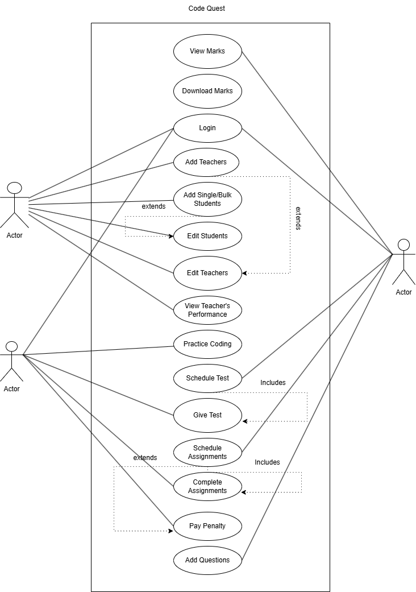
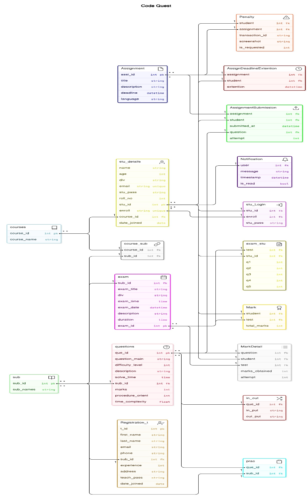
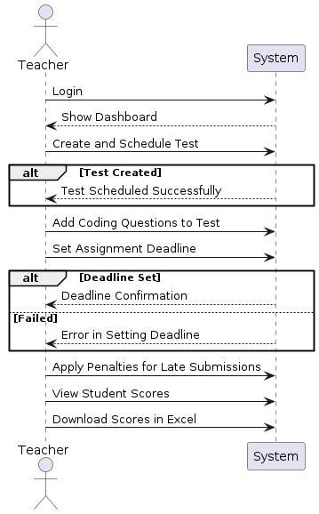
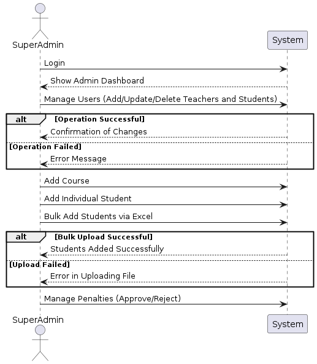
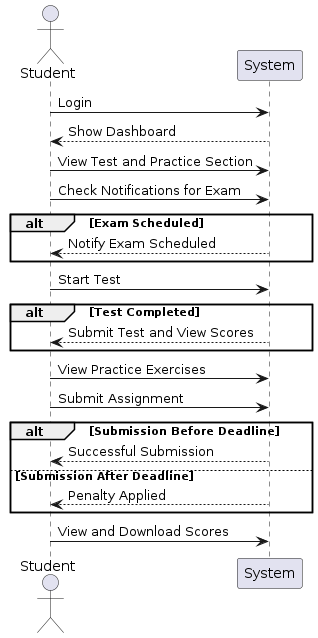
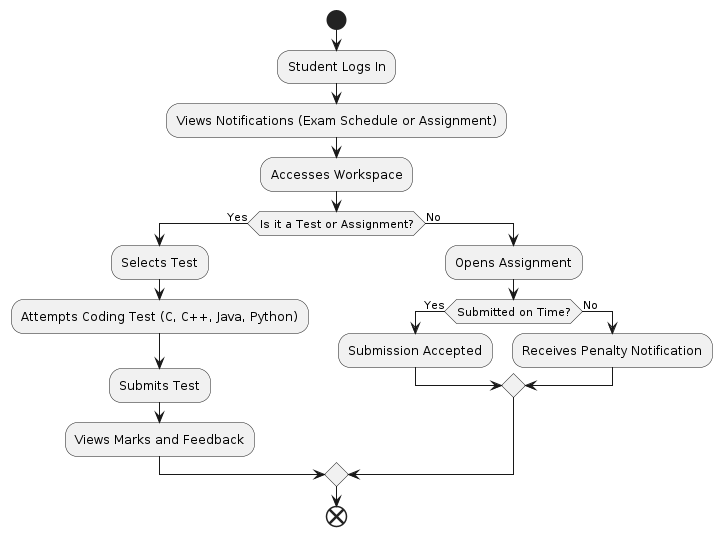
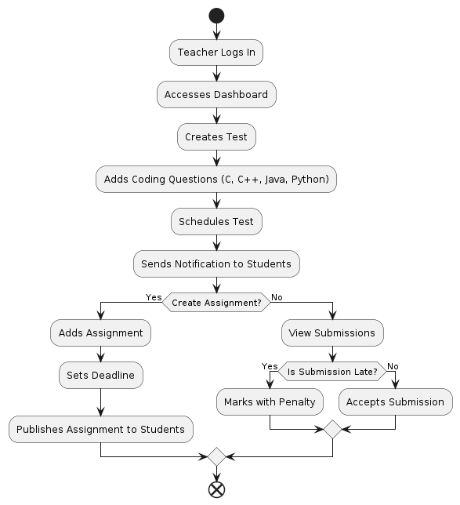
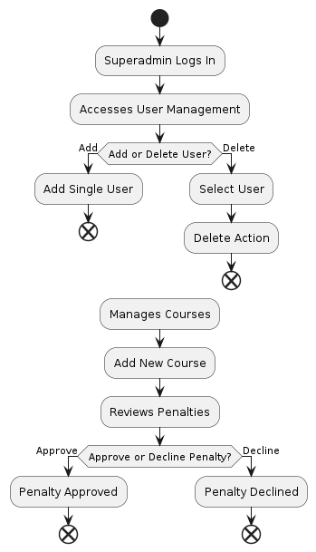
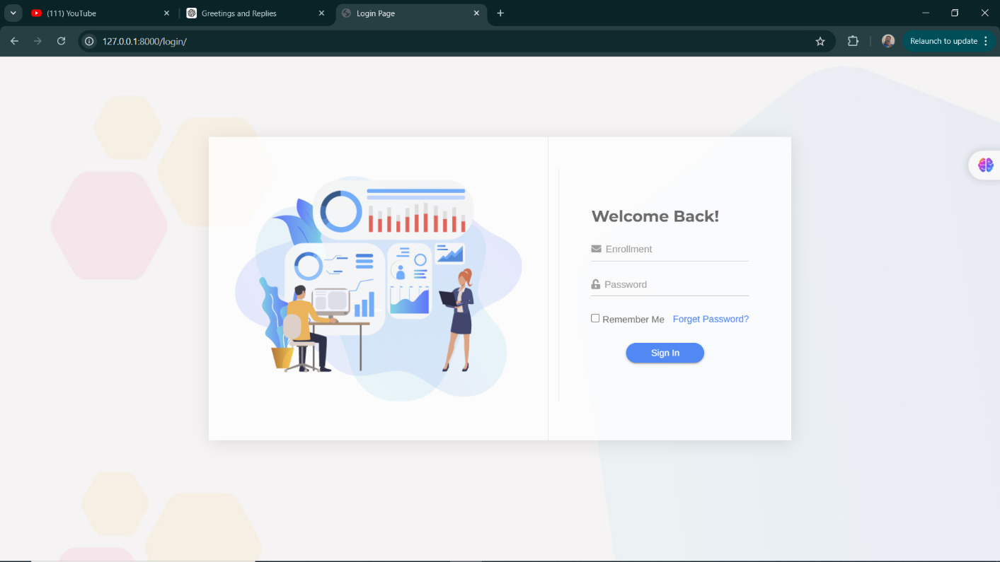
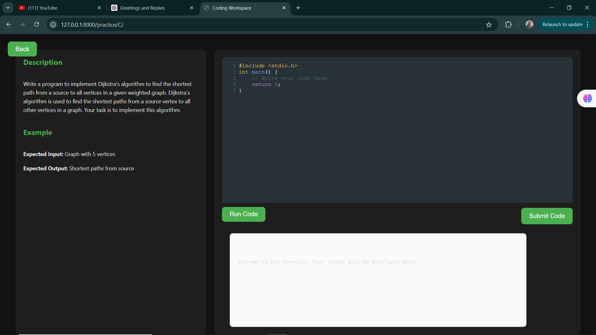

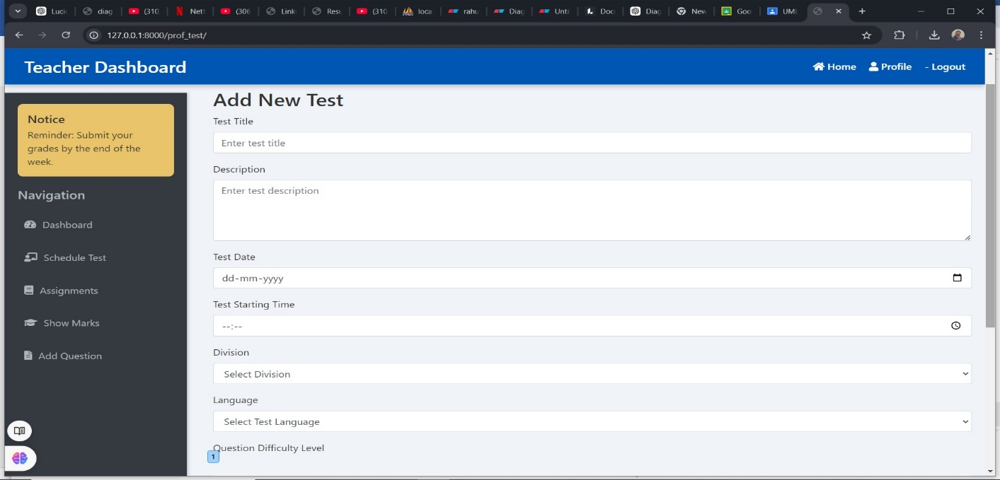
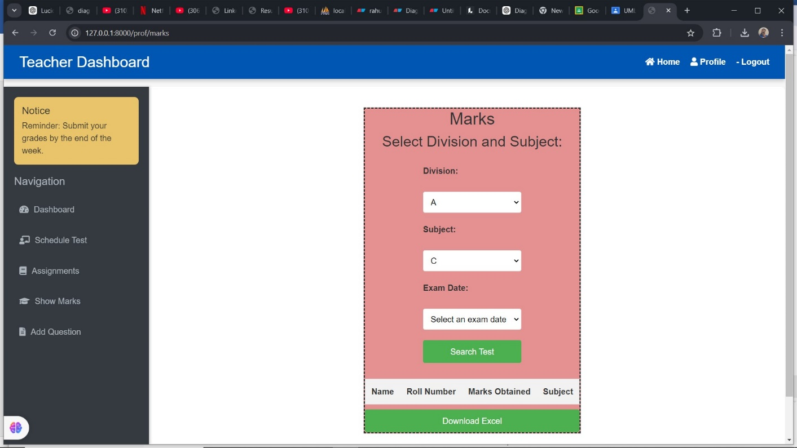
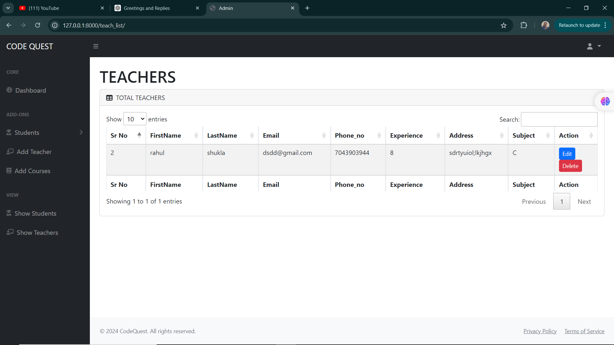
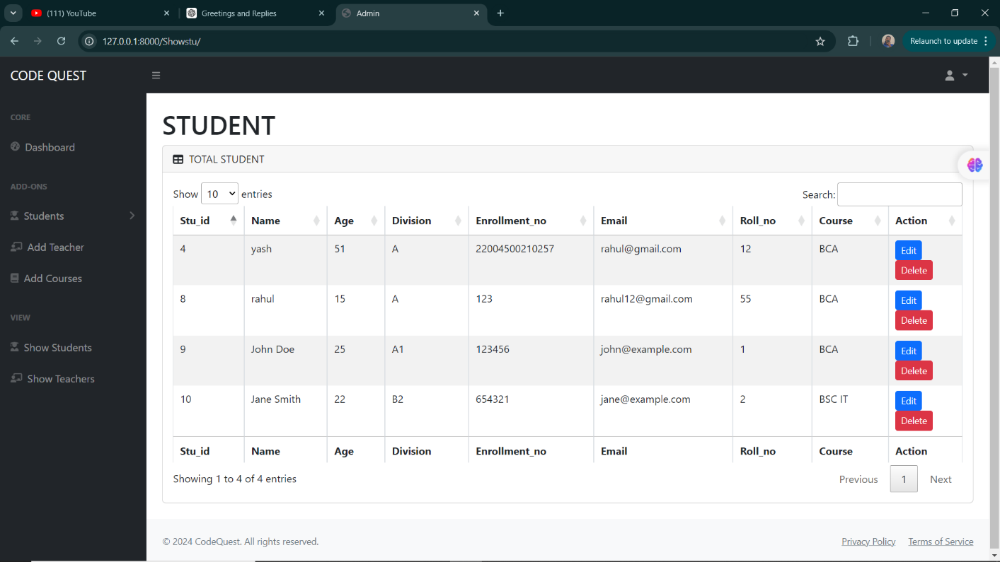
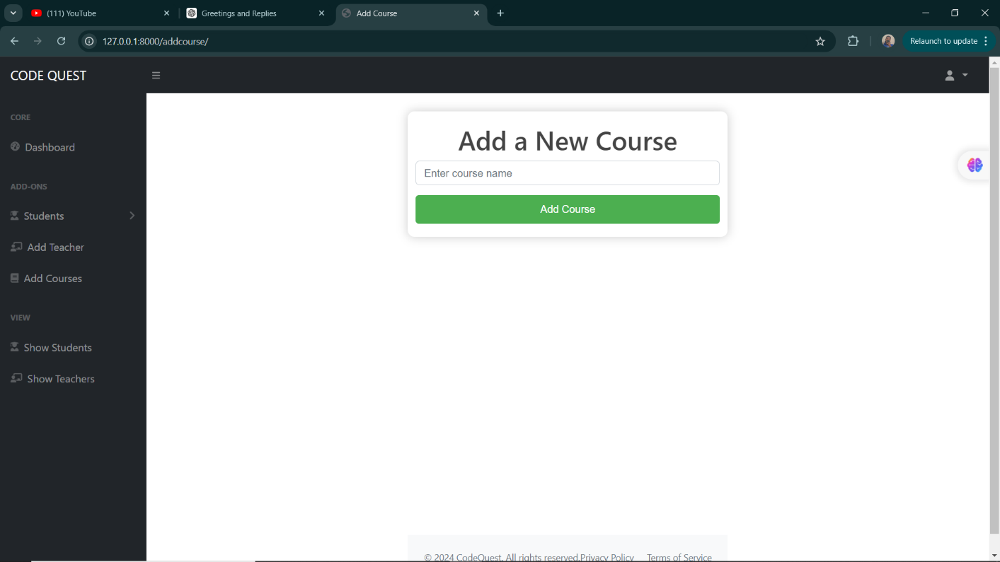
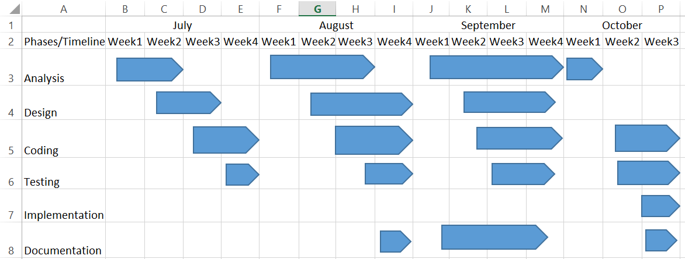


